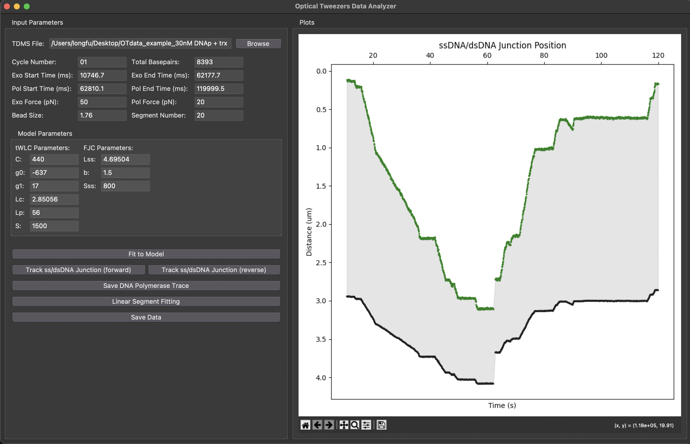

# Optical Tweezers Data Analyzer

This application provides a graphical user interface (GUI) for analyzing optical tweezers force-distance (F-D) data, specifically tailored for experiments studying the activity of DNA-modifying enzymes like DNA polymerases. It allows users to load raw data, identify different phases of an enzymatic reaction (e.g., exonuclease and polymerase activity), model the DNA tether mechanics, and track the enzyme's position over time.



## Features

- Load and visualize raw data from `.tdms` files.
- Interactively select time ranges for analysis directly from the plot.
- Analyze distinct experimental phases occurring at different constant forces.
- Model dsDNA and ssDNA extension using the Twistable Worm-Like Chain (tWLC) and Freely-Jointed Chain (FJC) models, respectively.
- Calculate the position of the ss/dsDNA junction to trace enzyme movement.
- Offers both 'forward' and 'reverse' tracking modes to account for different experimental setups.
- Perform piecewise linear fitting on the enzyme activity trace to determine rates.
- Export processed data (time, base pairs, junction position) to Excel (`.xlsx`).
- Save publication-quality plots (`.png`, `.eps`) of the analysis results.

## Installation & Dependencies

This application is built with Python and requires several scientific computing libraries. You can install them using pip:

```bash
pip install numpy matplotlib pandas nptdms sympy scipy fast_pwl_fit
```

## How to Use

1.  **Launch the App**: Run the script from your terminal:
    ```bash
    python OTdata_analyzer.py
    ```
2.  **Load Data**:
    - Click the **Browse** button to select your `.tdms` data file.
    - A plot of Force vs. Time will appear in the right-hand panel.

3.  **Define Time Ranges**:
    - The experiment is assumed to have two main phases: an exonuclease phase ("Exo") and a polymerase phase ("Pol").
    - To define the time range for a phase, first click inside the desired input box (e.g., "Exo Start Time (ms)").
    - Then, click on the corresponding point on the Force vs. Time plot. The time value will be automatically filled in.
    - Repeat this for all four time fields: Exo Start/End and Pol Start/End. You can also enter the values manually.

4.  **Set Parameters**:
    - Fill in the `Cycle Number`, `Total Basepairs` of your DNA construct, and the `Bead Size`.
    - Enter the constant force values for the `Exo Force (pN)` and `Pol Force (pN)` phases.
    - The `Model Parameters` for tWLC and FJC are pre-filled with common values but can be adjusted if your experiment requires different parameters.

5.  **Analyze and Visualize**:
    - **Fit to Model**: Click this to view the experimental F-D data overlaid with the theoretical tWLC and FJC model curves. It also shows a plot of the calculated base pairs remaining over time.
    - **Track ss/dsDNA Junction**: This is the primary analysis function.
        - Click **(forward)** or **(reverse)** depending on your experimental geometry.
        - This generates a plot showing the end-to-end distance of the tether and the calculated position of the polymerase (the "DNA Polymerase Trace").
    - **Linear Segment Fitting**: After generating a trace, click this button to perform a piecewise linear fit on the basepair vs. time data. This helps in identifying different activity rates (e.g., pauses, catalysis). The results and a plot are saved automatically.

6.  **Save Results**:
    - **Save DNA Polymerase Trace**: Saves the currently displayed junction trace plot as a high-quality `.eps` file, suitable for publications.
    - **Save Data**: This is a comprehensive save function. It creates a `results` sub-directory (if it doesn't exist) inside the folder containing your data file and saves the following:
        - An Excel file (`...-processedData.xlsx`) with the raw data for your selected time ranges.
        - Several plots in `.png` format capturing different aspects of the analysis (base pair changes, junction trace).
        - The junction trace plot as an `.eps` file.

## Output Files

All files saved via the **Save Data** or **Linear Segment Fitting** buttons are placed in a `results` folder, created in the same directory as your input `.tdms` file. Files are named using the original filename and the cycle number.

- `*processedData.xlsx`: Contains the calculated time series data, including junction position and base pairs.
- `*DNApTraces.png`/`.eps`: The main analysis plot showing enzyme position over time.
- `*BasepairChange-filtered.png`: Smoothed plot of base pairs vs. time.
- `*_segments.csv`: Data from the piecewise linear fit, including slopes (rates) for each segment.
- `*_segments.png`: A plot showing the piecewise linear fit overlaid on the data. 