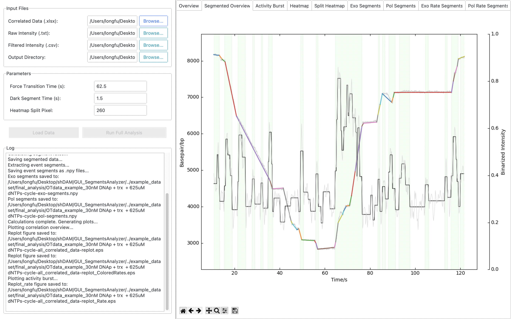

# Segments Analyzer GUI

A graphical user interface for correlated segment analysis of DNA polymerase activity. This tool provides an interactive way to process and visualize combined optical tweezers (force) and fluorescence microscopy data.



## Overview

This application streamlines the analysis of single-molecule DNA polymerase dynamics. It takes raw and processed data from different steps of an analysis pipeline and performs a correlated segment analysis. The user can load data, adjust key parameters, and visualize the results in real-time. All generated plots and segmented data are saved for further use.

The GUI is built on top of the analysis logic from the original `3_Correlated_segement_analysis.py` script, making the workflow more accessible and interactive.

## Features

- **Modern UI**: A clean, two-pane interface built with `ttkbootstrap`.
- **Interactive File Loading**: Select a primary data file, and the application will intelligently attempt to locate the associated files. Manual selection is always available as a fallback.
- **Adjustable Parameters**: Easily tune key analysis parameters like force transition time and heatmap splitting points directly from the GUI.
- **Embedded Plots**: All analysis plots (overviews, activity bursts, segment details, and correlation heatmaps) are embedded directly into the application in a tabbed view for easy inspection.
- **Live Logging**: A log panel provides real-time feedback on the analysis progress and any potential issues.
- **Data Export**: Automatically saves all generated plots as high-quality image files (`.png` and `.eps`) and exports segmented track data to an Excel file (`.xlsx`) and `.npy` files.

## Requirements

- Python 3.7+
- The required Python packages can be installed via pip. It is recommended to use a virtual environment.

You will need the following packages:
- `ttkbootstrap`
- `numpy`
- `matplotlib`
- `pandas`
- `opencv-python`
- `seaborn`
- `scipy`
- `more-itertools`
- `openpyxl`

You can install them all by running:
```bash
pip install ttkbootstrap numpy matplotlib pandas opencv-python seaborn scipy more-itertools openpyxl
```

## How to Use

1.  **Clone the repository** to your local machine.
2.  **Install the dependencies** as described in the Requirements section.
3.  **Run the application**:
    ```bash
    python GUI_SegmentsAnalyzer/app.py
    ```
4.  **Load Your Data**:
    - In the GUI, click the "Browse..." button next to **"Correlated Data (.xlsx)"**.
    - Select your primary Excel analysis file.
    - The application will attempt to auto-populate the paths for the "Raw Intensity (.txt)", "Filtered Intensity (.csv)", and "Output Directory".
    - If the auto-detection fails, or if your file structure is different, you can select the remaining files and the output directory manually using their respective "Browse..." buttons.
5.  **Load Data into Memory**:
    - Click the **"Load Data"** button. The log will confirm once the data is loaded successfully.
6.  **Adjust Parameters (Optional)**:
    - Modify the values for `Force Transition Time`, `Dark Segment Time`, or `Heatmap Split Pixel` as needed for your experiment.
7.  **Run Analysis**:
    - Click the **"Run Full Analysis"** button.
    - The analysis will run in the background. You can monitor its progress in the log panel.
    - As plots are generated, they will appear in the corresponding tabs on the right side of the window.
8.  **Review Results**:
    - Click through the different tabs to view the analysis plots. You can use the toolbar at the bottom of each plot to zoom, pan, and save.
    - All generated files (plots, Excel data, `.npy` segments) will be saved in the specified output directory.

## Expected File Structure

The automatic file detection feature (`browse_master_file`) assumes a specific directory structure, as seen in the example dataset. For this feature to work, your data should be organized as follows:
