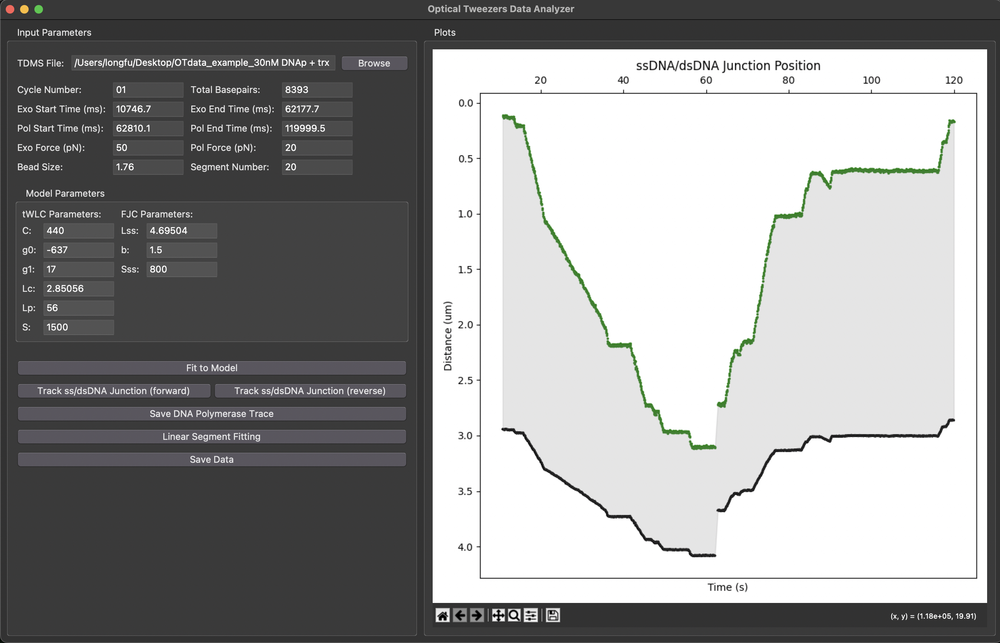
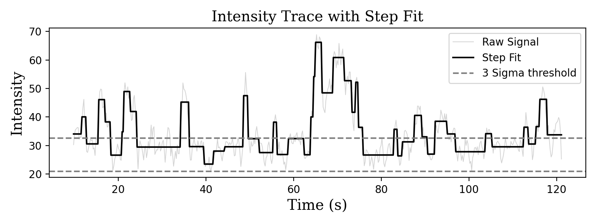

# Single-molecule high-resolution dynamics and activity mapping (shDAM) of DNA-binding proteins

This repository provides a comprehensive suite of tools for analyzing DNA polymerase dynamics at the replication fork, using data from fluorescence microscopy and optical tweezers. It offers multiple ways to process and visualize data, including Jupyter notebooks for exploration, Python scripts for automation, and Graphical User Interfaces (GUIs) for interactive analysis. All analysis scripts process mechanical data and associated fluorescence kymographs from `.tdms` files.

An example dataset is provided in the `example_dataset` folder for a complete walkthrough of the analysis pipeline.

## Analysis Workflow

The core analysis pipeline consists of three main steps, which correlate mechanical data from optical tweezers with fluorescence microscopy data:

1.  **Optical Tweezer (OT) Data Analysis**: This step processes raw mechanical data (from `.tdms` files) to determine the enzyme's activity. It involves calculating the corrected end-to-end distance (EED) of the DNA tether using polymer elasticity models (e.g., eWLC and FJC). This EED is then used to derive the high-resolution position of the enzyme's active site over time, creating a "DNA kymograph" that tracks activity in nanometers. Enzymatic rates (e.g., polymerization, exonuclease) and pausing events are identified from this mechanical data.

2.  **Kymograph Analysis and Correlation**: This step analyzes fluorescence kymographs to detect fluorescently labeled protein binding/unbinding. The mechanically-derived "DNA kymograph" from Step 1 is temporally and spatially overlaid onto the fluorescence kymograph. This alignment is critical for precisely correlating enzymatic activity with the presence of a protein.

3.  **Correlated Segment Analysis**: This final step performs an in-depth analysis of the synchronized data. The fluorescence signal at the activity site is extracted and binarized into "bound" (on) and "unbound" (off) states. Similarly, the mechanical data is segmented into "active" and "paused" states. By combining these, each time point is categorized into one of four states (e.g., fluorescent and active, fluorescent and paused, etc.), enabling detailed statistical analysis of binding lifetimes, activity bursts, and processivity.

## Installation and Setup

### Prerequisites
- Python 3.9
- Git

### Installation Steps

1.  Clone the repository:
    ```bash
    git clone https://github.com/longfuxu/shDAM.git
    cd shDAM
    ```

2.  Create and activate a virtual environment:
    ```bash
    # On macOS/Linux
    python -m venv venv
    source venv/bin/activate

    # On Windows
    python -m venv venv
    .\venv\Scripts\activate
    ```

3.  Install the required packages:
    ```bash
    pip install -r requirements.txt
    ```

## Usage

You can run the analysis using Jupyter Notebooks, Python scripts, or interactive GUIs. For a first-time user, we recommend starting with the Jupyter Notebooks and the provided example dataset.

### 1. Jupyter Notebooks
Ideal for a step-by-step walkthrough of the analysis pipeline.

1.  Start JupyterLab:
    ```bash
    jupyter lab
    ```
2.  Navigate to and run the notebooks in order:
    - `1_CalculatingDNApTrace_OT.ipynb`
    - `2_Correlation_image_force.ipynb`
    - `3_Correlated_segement_analysis.ipynb`

### 2. Python Scripts
Located in the `python_scripts/` directory, these are suitable for batch processing and automation. To run the analysis, execute the scripts in order:
```bash
python3 python_scripts/1_CalculatingDNApTrace_OT.py
python3 python_scripts/2_Correlation_image_force.py
python3 python_scripts/3_Correlated_segement_analysis.py
```

### 3. Graphical User Interfaces (GUIs)
For users who prefer interactive controls for data analysis. We provide GUIs for the key analysis steps:
- **GUI_OTdataAnalyzer**: For processing optical tweezer data.
- **GUI_KymographAnalyzer**: For analyzing kymographs and finding steps.
- **GUI_SegmentsAnalyzer**: For analyzing correlated segments.


_The GUI for Optical Tweezer data analysis._


_The GUI for Kymograph analysis._


_The GUI for Correlated Segments analysis._

## Reproducibility

### Parameter Tuning
The parameters in the notebooks, scripts, and GUIs are tuned for the provided example dataset. For your own data, these parameters will likely need to be adjusted to fit your specific experimental conditions and research system.

### Code Ocean
For fully reproducible results, a Code Ocean capsule is available:
- [Link to Code Ocean Capsule] (To be added upon publication)

## Advanced Algorithms for Data Analysis

This project integrates several powerful, standalone tools for specialized single-molecule data analysis. Each tool is available in its own directory and includes a graphical user interface (GUI) for ease of use.

### `autostepfinder_GUI`: Automated Step-Finding for Discrete Events
This tool provides an implementation of the `AutoStepfinder` algorithm, designed to rapidly and automatically detect discrete steps in time-series data. It is particularly well-suited for analyzing single-molecule traces where proteins or enzymes exhibit step-like movements or changes in state. The algorithm uses a dual-pass method to determine the optimal number of steps, providing a robust fit even for noisy data.

**Key Features**:
- Automated, dual-pass step detection.
- Interactive GUI to tune parameters and visualize fits in real-time.
- Exports step properties, including size, dwell time, and error.

**Original Algorithm Credit**:
This tool is based on the MATLAB code from the 2021 publication by Loeff et al. Please cite the original paper when using this algorithm:
> Loeff, L., Kerssemakers, J. W. J., Joo, C., & Dekker, C. (2021). AutoStepfinder: A fast and automated step detection method for single-molecule analysis. *Patterns*, Volume 2, Issue 5, 100256

### `ChangePointDetection_slope_GUI`: Detecting Changes in Gradual Traces
This tool is designed to identify significant changes in the slope of a data trace, making it ideal for analyzing processes with gradual transitions rather than abrupt steps. It implements the change-point detection algorithm described by Kerssemakers et al. (2006), which is effective for parsing phenomena such as the assembly/disassembly dynamics of biomolecules.

**Key Features**:
- Detects change-points in gradually varying data.
- Allows for fine-tuning of sensitivity via moving window size and noise parameters.
- Visualizes the original data, fitted segments, and the derivative trace.

**Original Algorithm Credit**:
The underlying method was first described in the 2006 Nature paper by Kerssemakers et al. Please cite this work when using the change-point detection algorithm:
> Kerssemakers, J., Munteanu, E., Laan, L., Noetzel, T. L., Janson, M. E., & Dogterom, M. (2006). Assembly dynamics of microtubules at molecular resolution. *Nature*, 442(7103), 709–712.

### `fast_pwl_fit_GUI`: Fast Piece-Wise Linear Fitting
This tool offers a fast algorithm for fitting time-series data with a series of connected straight lines (piece-wise linear). It is a general-purpose utility for segmenting traces into linear portions, which can be useful for identifying periods of constant velocity or rate.

## Example Walkthrough

The following images illustrate the key outputs from each stage of the analysis pipeline, run on the provided `example_dataset`.

#### Step 1: Optical Tweezer Data Analysis (`1_CalculatingDNApTrace_OT.ipynb`)
The initial step processes the mechanical data. It involves fitting the force-extension data to determine the tether's properties, calculating the percentage of ssDNA over time, and deriving the high-resolution DNA junction position, which represents the enzyme's activity trace.


#### Step 2: Kymograph Correlation (`2_Correlation_image_force.ipynb`)
Here, the mechanically-derived activity trace is correlated with the fluorescence kymograph. The fluorescence intensity along the enzyme's path is extracted, filtered, and binarized using a step-finding algorithm to identify protein binding events. All traces can then be visualized together.





#### Step 3: Segment Analysis and Visualization (`3_Correlated_segement_analysis.ipynb`)
The final step is to segment the continuous data into discrete states (e.g., active vs. paused, fluorescent vs. non-fluorescent). This allows for detailed statistical analysis, such as identifying activity bursts and their correlation with fluorescence, and generating summary visualizations like heatmaps.


## Contributing
We welcome contributions to enhance and expand this project. Please fork the repository, make your changes, and submit a pull request. You can also contact Dr.Longfu Xu or Prof. Gijs Wuite for contributions.

## Support and Contact
Please note that the code in this repository is custom-written for internal lab use and may still contain bugs. For questions, support, or feedback, please contact Dr. Longfu Xu at [longfu2.xu@gmail.com](mailto:longfu2.xu@gmail.com).

## Citation
Xu, L., Halma, M.T.J. & Wuite, G.J.L. Mapping fast DNA polymerase exchange during replication. *Nat Commun* **15**, 5328 (2024). https://doi.org/10.1038/s41467-024-49612-3

## License
This project is licensed under the MPL-2.0 license. See the `LICENSE` file for more details.

## Acknowledgments
All code in this repository was developed by Dr. Longfu Xu (longfuxu.com) during his PhD at the [Gijs Wuite Lab](http://www.gijswuite.com/). 